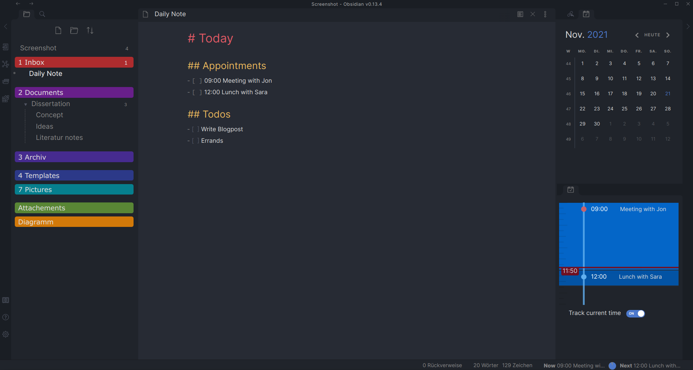
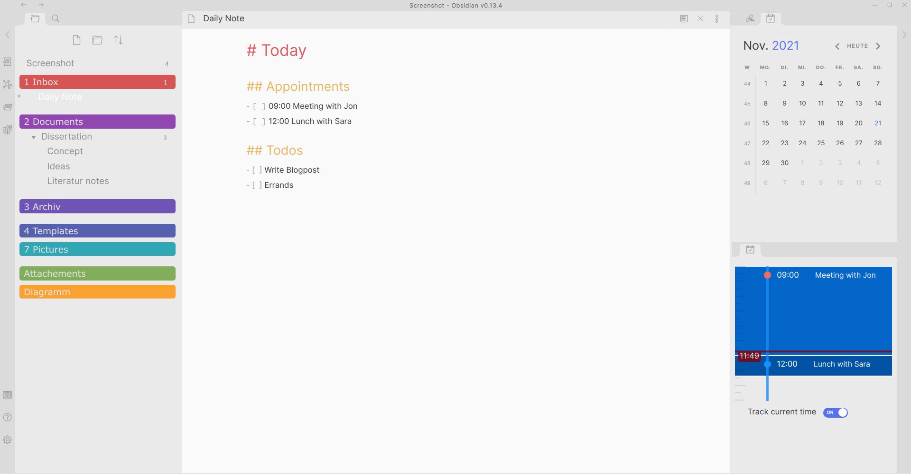

# Obsidian Atom Color

A theme for Obsidian based on Obsidian Atom from [Kognise](https://github.com/kognise) and the Colored Folder snippet from [Lithou](https://forum.obsidian.md/t/adding-color-to-obsidian-a-rainbow-of-possibility/12805/9). Thanks for their excellent work. 

 
 

## Installation

1. Download obsidian.css to the theme folder ('your Obsidian folder/.themes')
2. Download ColoredFolders.css to snippets folder ('your Obsidian folder/.snippets')
3. In Obsidian, click Settings -> appereance and enable the AtomicColor Theme
4. In Obsidian, click on Appereance -> enable the ColoredFolders snippet
5. Pick either light or dark theme in Obsidian's appearance settings!